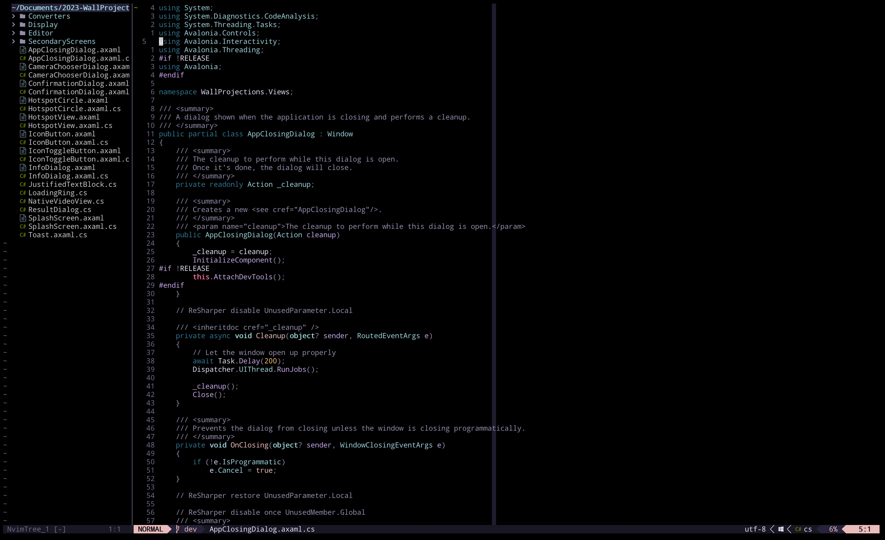
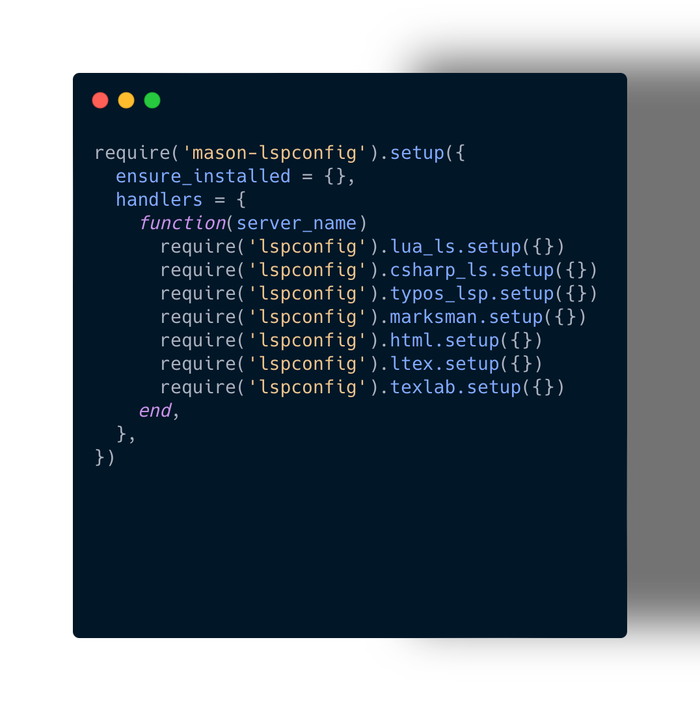

# My NeoVim Config

<!--toc:start-->
- [My NeoVim Config](#my-neovim-config)
  - [Example](#example)
  - [Contains](#contains)
  - [Setup](#setup)
    - [Creating the base config](#creating-the-base-config)
    - [Setting up the LSP](#setting-up-the-lsp)
    - [Get Symbols](#get-symbols)
  - [Commands](#commands)
<!--toc:end-->

## Example


## Contains
- Colour scheme (Rose-Pine)
- Packet manager 
- Telescope (file finder)
- Treesitter
- Harpoon
- UndoTree
- Fugative (git status)

## Setup
> [!IMPORTANT]
> This assumes that iTerm2 is the used console, regular terminal will not
work due to its limited colour pallet

### Creating the base config
First we need to clone the directory, rename the folder and clone the 
packer so that we can download the contents. Below are the commands to 
do this on Mac
```Console
foo@bar ~ % cd ~/.config/
git clone https://github.com/ed22699/NeoVimConfig.git
mv NeoVimConfig nvim
git clone --depth 1 https://github.com/wbthomason/packer.nvim\
 ~/.local/share/nvim/site/pack/packer/start/packer.nvim
```
Now we need to open up the cloned folder and navigate to packer
```Console 
foo@bar nvim % nvim lua/primary/packer.lua
```
run the following commands - :so, :PackerSync
### Setting up the LSP
Navigate to the LSP file 
```Console
foo@bar nvim % nvim after/plugin/lsp.lua
```
Install the following items using :Mason
- lua_ls
- csharp_ls
- typos_lsp
- marksman
- html
- ltex
- texlab
> [!NOTE]
> Follow the structure of the other languages if you would like to add more


### Get Symbols
For this you will need to install nerd fonts for iTerm2
```Console
foo@bar ~ $ curl -sS https://webi.sh/nerdfont | sh
```
Now go to settings -> profiles -> text and select the font as DroidSansMono NF
## Commands 
- <F4> to get up code actions
- <F3> to reformat code
